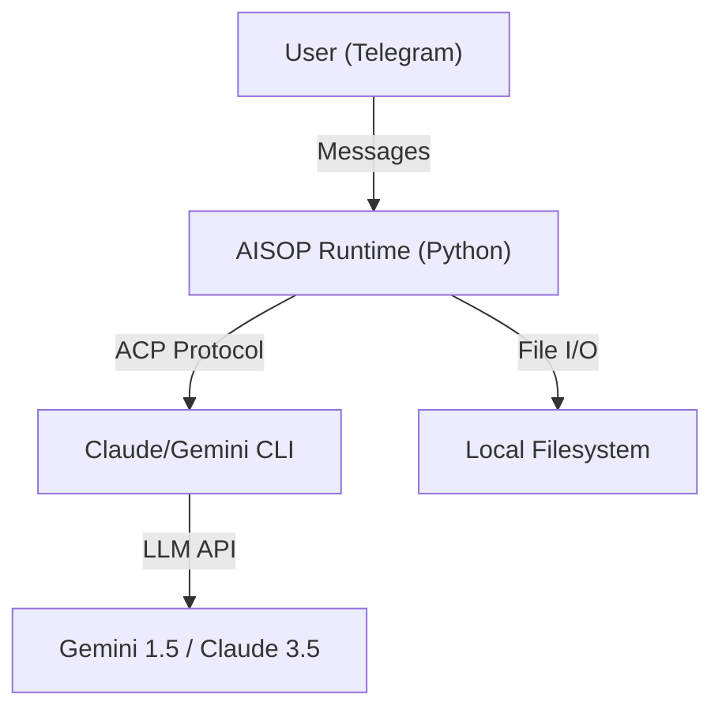

# AISOP Runtime

[**中文说明 (Chinese)**](README_ZH.md) | [**Protocol Specs**](https://github.com/aisop-protocol/aisop)

**The Universal Bridge for AISOP Protocols**

`aisop-runtime` is a robust, production-ready environment for executing **[AISOP (AI Standard Operating Protocol)](https://github.com/aisop-protocol/aisop)** v3.1 blueprints. It serves as a universal bridge, connecting front-end interfaces (starting with Telegram) to powerful local ACP (Agent Control Protocol) agents driven by Gemini or Claude.

## 🌟 Core Capabilities (The Three Pillars)

### 1. AISOP Protocol Lifecycle Management
Full support to **Generate**, **Run**, and **Upgrade** `.aisop.json` blueprints.
*   **Generate**: Create complex task blueprints from natural language.
*   **Run**: Pixel-perfect execution of standard AISOP v3.1 protocols.
*   **Upgrade**: Iteratively refine and version-control your agent behaviors.

### 2. Remote CLI Coding via Telegram
Turn your chat window into a powerful command center.
*   **Zero Latency Control**: Drive your local CLI environment remotely.
*   **Context-Aware**: The agent remembers your codebase context.
*   **ACP Integration**: Seamlessly powers Gemini CLI and Claude CLI.

### 3. Personal AI Assistant
Your 24/7 intelligent companion.
*   **Always On**: Ready to answer questions, draft content, or analyze data.
*   **Memory Persistent**: Maintains context across sessions.
*   **Fallback Safe**: Auto-switches between Flash/Sonnet models to ensure you're never left hanging.

## 🛠️ Installation

### Prerequisites
*   Python 3.10+
*   Node.js & npm (for CLI tools)
*   Telegram Bot Token (via @BotFather)

### Setup

1.  **Clone the repository** (and rename to `aisop-runtime` if needed):
    ```bash
    git clone <repo-url> aisop-runtime
    cd aisop-runtime
    ```

2.  **Install Python Dependencies**:
    ```bash
    pip install -r requirements.txt
    ```

3.  **Install ACP Drivers**:
    *   **For Gemini**:
        ```bash
        npm install -g @google/gemini-cli
        gemini auth login
        ```
    *   **For Claude**:
        ```bash
        npm install -g @anthropic-ai/claude-code
        npm install @zed-industries/claude-code-acp  # Critical Bridge
        claude /login
        ```

4.  **Configuration**:
    Copy the example configuration:
    ```bash
    cp .env.example .env
    ```
    Edit `.env` and fill in your `TELEGRAM_BOT_TOKEN`.

## ⚙️ Configuration (.env)

| Variable | Description | Default |
| :--- | :--- | :--- |
| `TELEGRAM_BOT_TOKEN` | Your Telegram Bot API Token | Required |
| `CLAUDE_CLI` | Enable Claude as the primary engine | `true` |
| `GEMINI_CLI` | Enable Gemini as the primary engine | `false` |
| `ENABLE_FALLBACK` | Auto-switch models on failure | `true` |
| `WORKSPACE_DIR` | Directory for agent file operations | `WORKSPACE` |

## 🏃 Usage

Start the runtime:
```bash
python main.py
```

### In Telegram:
*   **Chat**: Just talk to the bot to interact with the underlying Agent.
*   **Run Blueprints**:
    > `Run WORKSPACE/hello_world.aisop.json`

## 💻 Direct CLI Usage (Native Mode)
You can also use Claude or Gemini CLIs directly to interact with AISOP files, bypassing the Python runtime.

### 1. Create (Generate)
Generate a new blueprint from natural language.
```bash
# Claude
claude "Create a valid AISOP v3.1 file to [YOUR TASK HERE] and save it to WORKSPACE/task.aisop.json"

# Gemini
gemini prompt "Create a valid AISOP v3.1 file to [YOUR TASK HERE] and save it to WORKSPACE/task.aisop.json"
```

### 2. Run (Execute)
Execute an existing blueprint.
```bash
# Claude
claude "Read and strictly EXECUTE the blueprints in WORKSPACE/hello_world.aisop.json"

# Gemini
gemini prompt "Read and strictly EXECUTE the blueprints in WORKSPACE/hello_world.aisop.json"
```

### 3. Upgrade (Optimize)
Refine/Debug an existing blueprint.
```bash
# Claude
claude "Analyze WORKSPACE/task.aisop.json, fix any errors, optimize the steps, and overwrite the file."

# Gemini
gemini prompt "Analyze WORKSPACE/task.aisop.json, fix any errors, optimize the steps, and overwrite the file."
```

## 🧩 Architecture



## 📄 License
MIT
