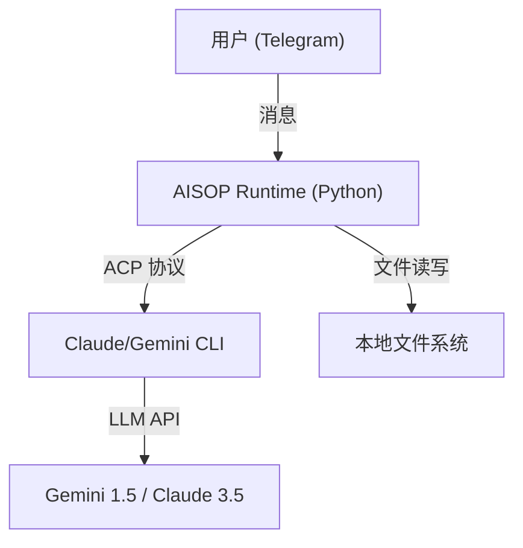

# AISOP Runtime (中文说明)

[**English Docs**](README.md) | [**AISOP 协议规范 (Protocol Specs)**](https://github.com/aisop-protocol/aisop)

**AISOP 协议的通用运行环境（万能桥梁）**

`aisop-runtime` 是一个生产级的执行环境，专门用于解析和运行 **[AISOP (AI Standard Operating Protocol)](https://github.com/aisop-protocol/aisop)** v3.1 蓝图。它充当了一座通用的桥梁，将前端交互界面（目前支持 Telegram）与强大的本地 ACP (Agent Control Protocol) 智能体（由 Gemini 或 Claude 驱动）连接起来。

## 🌟 核心能力 (三大支柱)

### 1. AISOP 协议全生命周期管理
支持对 `.aisop.json` 蓝图的 **生成**、**运行** 和 **升级**。
*   **生成 (Generate)**: 通过自然语言创建复杂的任务蓝图。
*   **运行 (Run)**: 像素级精确执行标准 AISOP v3.1 协议。
*   **升级 (Upgrade)**: 对 Agent 的行为模式进行迭代优化和版本控制。

### 2. 通过 Telegram 远程 CLI 编程
将您的聊天窗口变成强大的远程指挥中心。
*   **零延迟控制**: 随时随地远程驱动本地 CLI 开发环境。
*   **上下文感知**: 智能体能够记忆您的代码库上下文，无需重复喂料。
*   **双引擎驱动**: 无缝集成 Gemini CLI 或 Claude CLI 的底层能力。

### 3. 个人 AI 助理
您的 7x24 小时智能伙伴。
*   **随时在线**: 回答问题、起草内容或分析数据，永不掉线。
*   **记忆持久化**: 支持跨会话的长久记忆。
*   **自动容错**: 独有的 Flash/Sonnet 自动切换机制，确保服务永不中断。

## 🛠️ 安装指南

### 前置要求
*   Python 3.10+
*   Node.js & npm (用于安装 CLI 工具)
*   Telegram Bot Token (通过 @BotFather 获取)

### 快速开始

1.  **克隆仓库**:
    ```bash
    git clone <repo-url> aisop-runtime
    cd aisop-runtime
    ```

2.  **安装 Python 依赖**:
    ```bash
    pip install -r requirements.txt
    ```

3.  **安装 ACP 驱动**:
    *   **Gemini 用户**:
        ```bash
        npm install -g @google/gemini-cli
        gemini auth login
        ```
    *   **Claude 用户**:
        ```bash
        npm install -g @anthropic-ai/claude-code
        npm install @zed-industries/claude-code-acp  # 关键桥接组件
        claude /login
        ```

4.  **配置环境**:
    复制示例配置文件：
    ```bash
    cp .env.example .env
    ```
    编辑 `.env` 文件并填入您的 `TELEGRAM_BOT_TOKEN`。

## ⚙️ 配置说明 (.env)

| 变量名 | 描述 | 默认值 |
| :--- | :--- | :--- |
| `TELEGRAM_BOT_TOKEN` | Telegram 机器人的 API Token | 必须填写 |
| `CLAUDE_CLI` | 启用 Claude 作为主引擎 | `true` |
| `GEMINI_CLI` | 启用 Gemini 作为主引擎 | `false` |
| `ENABLE_FALLBACK` | 启用故障自动切换 (Failover) | `true` |
| `WORKSPACE_DIR` | Agent 文件操作的工作目录 | `WORKSPACE` |

## 🏃 使用方法

启动运行时：
```bash
python main.py
```

### 在 Telegram 中使用:
*   **自由对话**: 直接与机器人聊天，它会调用底层 Agent 进行回复。
*   **运行蓝图**:
    > `运行 WORKSPACE/hello_world.aisop.json`

## 💻 直接使用 CLI (原生模式)
您也可以跳过 Python 运行时，直接使用 Claude 或 Gemini 命令行工具来操作 AISOP 文件。这也证明了 AISOP 协议的通用性。

### 1. 新建 (Generate)
通过自然语言描述来生成一个新的蓝图文件。
```bash
# Claude
claude "Create a valid AISOP v3.1 file to [您的任务描述] and save it to WORKSPACE/task.aisop.json"

# Gemini
gemini prompt "Create a valid AISOP v3.1 file to [您的任务描述] and save it to WORKSPACE/task.aisop.json"
```

### 2. 运行 (Run)
执行一个现有的蓝图文件。
```bash
# Claude
claude "Read and strictly EXECUTE the blueprints in WORKSPACE/hello_world.aisop.json"

# Gemini
gemini prompt "Read and strictly EXECUTE the blueprints in WORKSPACE/hello_world.aisop.json"
```

### 3. 升级 (Upgrade)
修复或优化现有的蓝图。
```bash
# Claude
claude "Analyze WORKSPACE/task.aisop.json, fix any errors, optimize the steps, and overwrite the file."

# Gemini
gemini prompt "Analyze WORKSPACE/task.aisop.json, fix any errors, optimize the steps, and overwrite the file."
```

## 🧩 架构概览



## 📄 许可证 (License)
MIT
