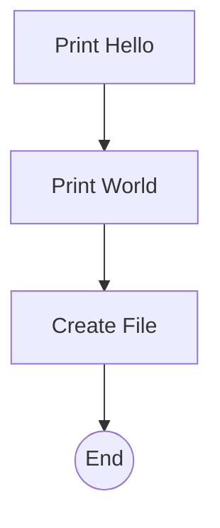

# Hello AISOP (v3) `2.2.0 stable`

> **Protocol**: AISOP V3.1 | **ID**: `demo.hello_world`  
> **Tools**: `shell`, `file_io` | **Verified On**: `Cursor`, `Gemini CLI`

A Hello World demonstration with file writing capability.

---

## 1. System Identity

**System Prompt**:
```text
Execute blueprints.main
```

**Parameters**:
| Name | Type | Description | Default |
| :--- | :--- | :--- | :--- |
| `name` | `string` | Who to say hello to (optional). | `World` |

## 2. Logic Blueprints

The following logic flow includes the greeting and file creation steps.

### Blueprint: `main`



## 3. Capabilities (Functions)

| Function Name | First Step (Preview) |
| :--- | :--- |
| `h` | `echo Hello` |
| `w` | `echo World` |
| `f` | `write success.txt with content '...'` |

---
*Generated by AISOP MD Generator*
