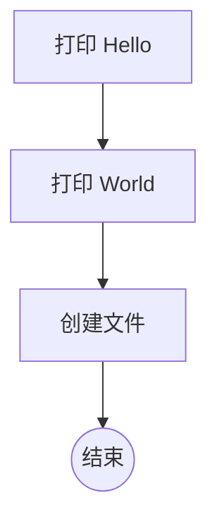

# Hello AISOP (v3) `2.2.0 stable`

> **协议版本**: AISOP V3.1 | **ID**: `demo.hello_world`  
> **所需工具**: `shell`, `file_io` | **验证平台**: `Cursor`, `Gemini CLI`

一个带有文件写入功能的 Hello World 演示程序。

---

## 1. 系统身份 (System Identity)

**系统提示词 (System Prompt)**:
```text
执行 blueprints.main
```

**输入参数 (Parameters)**:
| 参数名 | 类型 | 描述 | 默认值 |
| :--- | :--- | :--- | :--- |
| `name` | `string` | 招呼对象 (可选)。 | `World` |

## 2. 逻辑蓝图 (Logic Blueprints)

以下逻辑流展示了从问候到文件创建的完整路径。

### 蓝图: `main`



## 3. 功能实现 (Functions)

| 功能名称 | 第一步操作 (预览) |
| :--- | :--- |
| `h` | `echo Hello` |
| `w` | `echo World` |
| `f` | `write success.txt with content '...'` |

---
*由 AISOP MD 生成器生成 (中文版)*
